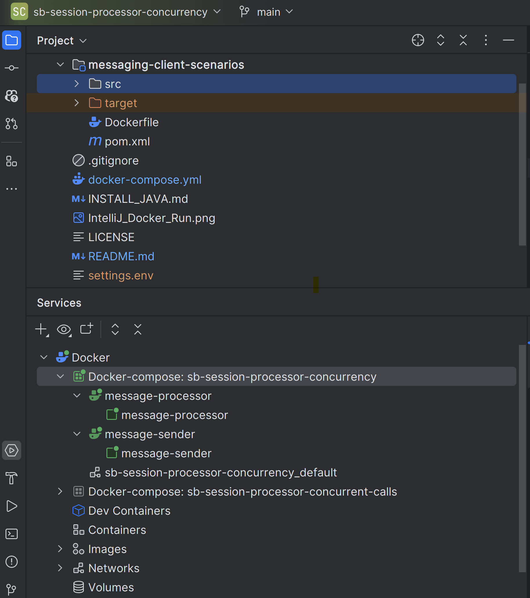
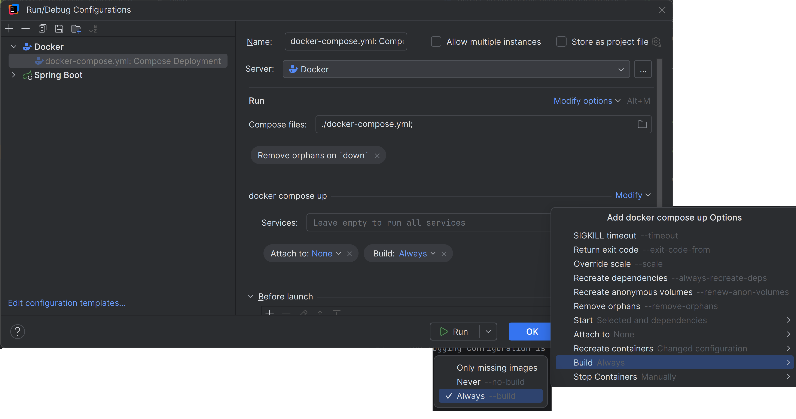

# Prerequisite
1. [Java 21+](INSTALL_JAVA.md)
2. [Docker](https://docs.docker.com/desktop/install/windows-install/).
3. [IntelliJ]( https://www.jetbrains.com/idea/download/?section=windows) with [Docker plugin]( https://www.jetbrains.com/help/idea/docker.html#install_docker) (the plugin is available by default in IntelliJ IDEA Ultimate).

# Run using Docker

1. Clone the repo.
2. Create the file `settings.env` in the root directory (i.e. `./sb-session-processor-concurrency` ) with the following content:
```
AZURE_SERVICEBUS_CONNECTION_STRING=<connection-string>
AZURE_SERVICEBUS_TOPIC_SUBSCRIPTION=<topic>:<subscription>
```

*  Update `<connection-string>` with Azure Service Bus connection string.
*  Update `<topic>:<subscription>` pair with existing topic and subscription name.
3. Open the directory `sb-session-processor-concurrency` in IntelliJ.
4. From the IntelliJ terminal (View|Tool Windows|Terminal) switch to `messaging-client-scenarios` directory and package the Java App
      > C:\code\sb-session-processor-concurrency> cd messaging-client-scenarios

      > C:\code\sb-session-processor-concurrency\messaging-client-scenarios> mvn clean package spring-boot:repackage
5. Right-click on the `docker-compose.yml` in IntelliJ Project View and select `Run 'docker-compose.yml: …'`. This will launch two containers - `message-sender`, running the Service Bus Sender and `message-processor`, running the Service Bus Processor consuming messages enqueued by the sender.

[](IntelliJ_Docker_Run)

# Reference

## configurations in docker-compose.yml

The `docker-compose.yml` file specifies environment variables to adjust configurations for Service Bus Processor and Sender. 

The Processor configurations that can be adjusted include - max concurrent sessions, concurrent calls, the max session lock renewal duration, and session idle timeout.

```
- MAX_CONCURRENT_SESSIONS=6          # Process up to 'MAX_CONCURRENT_SESSIONS' sessions.
- MAX_CONCURRENT_CALLS=3             # Process each session with up to 'MAX_CONCURRENT_CALLS' concurrent calls.
- SESSION_IDLE_TIMEOUT_IN_SECONDS=30 # 30 seconds
- SESSION_MAX_LOCK_RENEWAL_DURATION_IN_SECONDS=300 # 5 minutes.
```
The Sender configuration includes the number of sessions to send messages to, the method for choosing sessions (sequentially or randomly), and the message send rate (for example, 5 messages per second, 2 messages every 5 seconds..).

```
- SEND_SESSIONS=12            # Send messages to 'SEND_SESSIONS' sessions.
- SESSION_ID_MODE=SEQUENTIAL  # How to pick session to send message to: SEQUENTIAL = (0..SEND_SESSIONS..0..SEND_SESSIONS...) or RANDOM = rand(0..SEND_SESSIONS)
- SECONDS_IN_PERIOD=6
- SEND_MESSAGES_PER_PERIOD=5  # Send at a rate of 'SEND_MESSAGES_PER_PERIOD' messages per 'SECONDS_IN_PERIOD' (e.g., 5 messages in every 6 seconds).
- SEND_CONCURRENCY=1          # Send messages 'SEND_CONCURRENCY' concurrent calls.
```

## logging

The logging configuration is under `src/resources/log4j2.xml`.

## Making code changes

If you’re making code changes, then remember to repackage the Java app and set IntelliJ to docker compose to re-build the image

```
Run -> Edit Configurations
```

[](IntelliJ_Docker_Compose_Build_Always)
